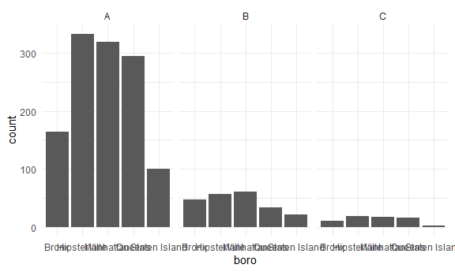

Strings and Factors
================

``` r
library(tidyverse)
```

    ## -- Attaching packages ----------------------------------------------------------------------------------------------------------------------------------------- tidyverse 1.3.0 --

    ## v ggplot2 3.3.2     v purrr   0.3.4
    ## v tibble  3.0.3     v dplyr   1.0.2
    ## v tidyr   1.1.2     v stringr 1.4.0
    ## v readr   1.3.1     v forcats 0.5.0

    ## -- Conflicts -------------------------------------------------------------------------------------------------------------------------------------------- tidyverse_conflicts() --
    ## x dplyr::filter() masks stats::filter()
    ## x dplyr::lag()    masks stats::lag()

``` r
library(p8105.datasets)
library(rvest)
```

    ## Loading required package: xml2

    ## 
    ## Attaching package: 'rvest'

    ## The following object is masked from 'package:purrr':
    ## 
    ##     pluck

    ## The following object is masked from 'package:readr':
    ## 
    ##     guess_encoding

``` r
library(httr)


knitr::opts_chunk$set(
  fig.width = 6,
  fig.asp = 0.6,
  out.width = "90%"
)

theme_set(theme_minimal() + theme(legend.position = "bottom"))

## all plots i make will have the viridis color palette
options(
  ggplot2.continuous.colour = "viridis",
  ggplot2.continuous.fill = "viridis"
)

scale_colour_discrete = scale_colour_viridis_d
scale_fill_discrete = scale_fill_viridis_d
```

## Restaurant example

What is a parsing failure? If one of the import steps that converts data
from one form to anther, and it doesn’t match, R will think the data is
wrong

``` r
api_url = "https://data.cityofnewyork.us/resource/43nn-pn8j.csv"

rest_inspections = 
  GET(api_url, query = list("$limit" = 50000)) %>% 
  content("parsed")
```

    ## Parsed with column specification:
    ## cols(
    ##   .default = col_character(),
    ##   camis = col_double(),
    ##   zipcode = col_double(),
    ##   phone = col_double(),
    ##   inspection_date = col_datetime(format = ""),
    ##   score = col_double(),
    ##   grade_date = col_datetime(format = ""),
    ##   record_date = col_datetime(format = ""),
    ##   latitude = col_double(),
    ##   longitude = col_double(),
    ##   community_board = col_double(),
    ##   bin = col_double(),
    ##   bbl = col_double()
    ## )

    ## See spec(...) for full column specifications.

    ## Warning: 72 parsing failures.
    ##  row   col               expected     actual         file
    ## 1077 phone a double               __________ <raw vector>
    ## 1388 phone a double               __________ <raw vector>
    ## 1651 phone no trailing characters _512_60    <raw vector>
    ## 2148 phone no trailing characters __         <raw vector>
    ## 2690 phone no trailing characters __         <raw vector>
    ## .... ..... ...................... .......... ............
    ## See problems(...) for more details.

``` r
rest_inspections %>%  
  count(boro, grade) %>% 
  pivot_wider(
    names_from = grade,
    values_from = n
  )
```

    ## # A tibble: 6 x 8
    ##   boro              A     B     C  `NA`     N     P     Z
    ##   <chr>         <int> <int> <int> <int> <int> <int> <int>
    ## 1 0                10     1     2    14    NA    NA    NA
    ## 2 Bronx          1752   358   124  2153    11    31    13
    ## 3 Brooklyn       5180   819   295  6351    82    98    38
    ## 4 Manhattan      7809  1314   495  9895   123   114    68
    ## 5 Queens         4442   746   230  5492    84    82    54
    ## 6 Staten Island   769   107    31   780    16    11     6

``` r
rest_inspections = 
  rest_inspections %>% 
  filter(grade %in% c("A", "B", "C"), boro != "0")
```

Lets look at pizza places

``` r
rest_inspections %>% 
  mutate(dba = str_to_upper(dba)) %>% 
  filter(str_detect(dba, "PIZZ")) %>% 
  count(boro, grade) %>% 
  pivot_wider(
    names_from = grade,
    values_from = n
  )
```

    ## # A tibble: 5 x 4
    ##   boro              A     B     C
    ##   <chr>         <int> <int> <int>
    ## 1 Bronx           164    47    10
    ## 2 Brooklyn        333    57    18
    ## 3 Manhattan       319    61    17
    ## 4 Queens          294    34    16
    ## 5 Staten Island   100    22     2

``` r
rest_inspections %>% 
  mutate(dba = str_to_upper(dba)) %>% 
  filter(str_detect(dba, "PIZZ")) %>% 
  mutate(
    boro = fct_infreq(boro),
    boro = str_replace(boro, "Brooklyn", "HipsterVille")
  ) %>% 
  ggplot(aes(x = boro)) +
  geom_bar() +
  facet_wrap(. ~grade)
```



## Napoleon Dynamite

Get some Napoleon Dynamite Amazon reviews

``` r
nap_url = "https://www.amazon.com/product-reviews/B00005JNBQ/ref=cm_cr_arp_d_viewopt_rvwer?ie=UTF8&reviewerType=avp_only_reviews&sortBy=recent&pageNumber=1"

napoleon_html = read_html(nap_url)

review_titles = 
  napoleon_html %>% 
  html_nodes(".a-text-bold span") %>% 
  html_text()

review_text = 
  napoleon_html %>% 
  html_nodes(".review-text-content span") %>% 
    html_text()

nap_df = 
  tibble(
    titles = review_titles,
    text = review_text
  )
```
